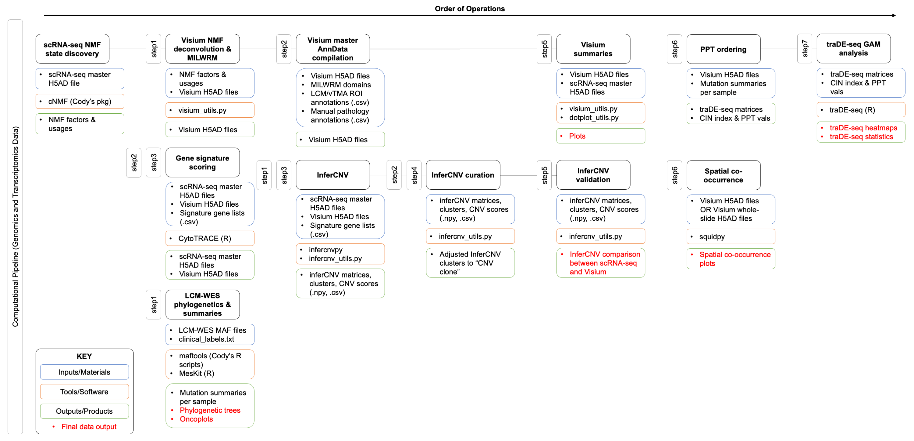

# spatial_CRC_atlas

Code to reproduce results from [Heiser, *et al.* (2023)](https://doi.org/10.1101/2023.03.09.530832).

## Purpose

These analyses integrate single-cell RNA sequencing (scRNA-seq), spatial transcriptomics (ST), multiplex immunofluorescence (MxIF), and multiregional exome sequencing via laser-capture microdissection (LCM-WES) to generate models and metrics presented in our manuscript, "Molecular cartography uncovers evolutionary and microenvironmental dynamics in sporadic colorectal tumors" (currently in review at *Cell*; bioRxiv preprint available: [doi.org/10.1101/2023.03.09.530832](https://doi.org/10.1101/2023.03.09.530832)). Functions herein include:

* Reading in and pre-processing data
* Scoring literature-derived gene signatures in scRNA-seq and ST
* Somatic CNV inference in scRNA-seq and ST
* Phylogenetic analysis from LCM-WES
* refNMF cell state deconvolution between scRNA-seq and ST
* Single-cell segmentation and quantification of MxIF images
* Spatial registration of MxIF and ST
* MILWRM tissue domain detection
* Summaries and visualizations of integrated spatial data
* GAM modeling of genes, gene signatures, and cell states along progression pseudotime (PPT)
* Immune Exclusion analysis in ST and MxIF

## Order of Operations

Code in this repository is intended to be run in order, as some analyses depend on outputs from previous tools. We therefore divide up the analysis notebooks into steps, provided as ordered directories.

1. Download publicly available data using the scripts in the `data/` directory first
2. Proceed to the notebooks in the `step1/` directory, then `step2/`, and `step3/` and so forth. All notebooks residing in the same directory can be run in any order, but they *all* must be successfully run before proceeding to the next step.

## Flow Chart of Analyses

